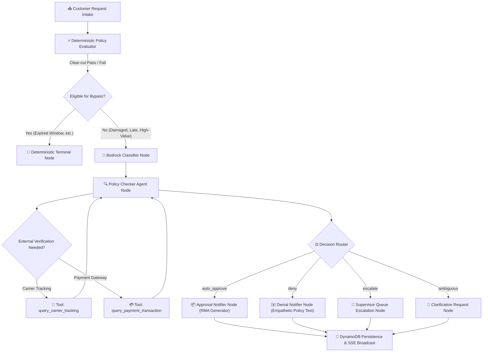

# 🛒 AI Refund Request Processor

[](LICENSE)
[](backend/pyproject.toml)
[](https://fastapi.tiangolo.com)
[](https://langchain-ai.github.io/langgraph/)
[](https://aws.amazon.com/bedrock/)
[](frontend/package.json)
[](frontend/playwright.config.ts)

> ⚡ **AI Refund Request Processor** is an autonomous back-office AI platform that automates e-commerce refund intake, multimodal damage verification, policy evaluation, and tiered human-in-the-loop escalation using **LangGraph**, **AWS Bedrock**, **Amazon DynamoDB**, and **React**.

---

## 📑 Table of Contents

- [🌟 Highlights & Capabilities](#-highlights--capabilities)
- [🎯 Problem & Solution](#-problem--solution)
- [🔄 Core Operational Workflows](#-core-operational-workflows)
- [🏗️ System Architecture](#️-system-architecture)
- [⚖️ Evaluation & Guardrails](#️-evaluation--guardrails)
- [🧪 Testing & Quality Assurance](#-testing--quality-assurance)
- [📈 Monitoring & Observability](#-monitoring--observability)
- [🚀 Quickstart Guide](#-quickstart-guide)
- [⚙️ Configuration & Mock Data](#️-configuration--mock-data)
- [📂 Project Directory Structure](#-project-directory-structure)
- [💡 Design Decisions & Trade-offs](#-design-decisions--trade-offs)
- [🚢 Cloud Deployment Architecture](#-cloud-deployment-architecture)
- [🛡️ Boundaries & Roadmap](#️-boundaries--roadmap)
- [📄 License](#-license)

---

## 🌟 Highlights & Capabilities

- 🤖 **Autonomous Multi-Agent Orchestration**: Specialized LangGraph state machines coordinate dispute intent classification, policy rules auditing, and customer communication.
- 👁️ **Multimodal Vision Inspection**: Analyzes uploaded damage photos with AWS Bedrock Converse, adapting inspection prompts based on image dimensions, aspect ratio, and resolution tiers (macro close-up vs. panoramic wide).
- 🔍 **Mandatory Dual-Tool Auditing**: Enforces automated external verification via `query_carrier_tracking` and `query_payment_transaction` on high-value orders ($400+) before granting approvals.
- 🛡️ **Tiered Role-Based Approval Ceilings**: Enforces organizational disbursement governance with automated escalation ($100 Support Agent, $500 Supervisor, $2,500 Senior Manager).
- ⚡ **Real-Time Reactive Streaming**: Live Server-Sent Events (SSE) push workflow completions, status transitions, and audit logs to the web dashboard instantly.
- 📊 **Operational Analytics & Scheduled Reports**: Pure-Python PDF-1.4 report generator, customizable 13-column CSV/JSON exports, and automated delivery schedules via Amazon SES.
- 🦠 **Asynchronous Security & Antivirus Guard**: Inspects customer evidence files asynchronously for EICAR test signatures, PE/ELF executable headers, and script polyglots with RFC 9457 quarantine blocking.
- 🧪 **100% Offline Deterministic Reproducibility**: 1,188 automated tests running offline without requiring live AWS credentials, plus live integration suites against real AWS services.

---

## 🎯 Problem & Solution

### 💥 The E-Commerce Dispute Challenge
Handling customer returns and refunds is among the highest operational cost centers for modern retailers:
- ⏳ **High Resolution Latency**: Customers endure 3 to 7 business days waiting for human agents to manually verify tracking numbers, inspect damage photos, and calculate return windows.
- 🎲 **Inconsistent Decision Quality**: Human support reps frequently apply complex return policies inconsistently, approving non-returnable items or denying valid customer claims.
- 💸 **Return Fraud & Financial Leakage**: Friendly fraud, empty-box claims, and staged damage cost retailers billions annually when claims are rubber-stamped without external carrier cross-checks or visual verification.
- 🚧 **High-Value Dispute Bottlenecks**: High-dollar disputes ($400+) often lack structured audit trails, triggering slow internal email threads rather than clear hierarchical authorization limits.

### ✨ The Solution
**AI Refund Request Processor** turns refund operations into an autonomous, transparent, and auditable pipeline:
1. **Instantly Resolves Clear-Cut Cases**: Valid claims within return windows are auto-approved in seconds with generated RMA instructions; clear policy breaches (e.g., return window expired 45 days ago) are denied deterministically without burning LLM tokens.
2. **Deep Inspection on Ambiguous Claims**: Customer photo evidence undergoes automated dimension parsing and multimodal Bedrock vision analysis to verify legitimate defects.
3. **Multi-Tool External Verification**: Discrepancies and high-value claims automatically trigger live carrier tracking and payment gateway cross-checks.
4. **Human-in-the-Loop Governance**: Operators review full synthesized agent reasoning chains, initiate customer clarification requests, or execute policy overrides within strict role limits.

---

## 🔄 Core Operational Workflows

The application supports four primary operational workflows:

```
[Customer Intake] ──► [LangGraph Multi-Agent Engine]
                             │
       ┌─────────────────────┼─────────────────────┐
       ▼                     ▼                     ▼
 [Auto-Approve]            [Deny]              [Escalate]
  • Generate RMA       • Empathetic Email   • Supervisor Queue
  • Instant Payout     • Policy Reason      • Tiered Approval ($100-$2500)
```

### 1. 🟢 Autonomous Approval (`auto_approve`)
- **Trigger**: Eligible claims for valid orders (e.g., delivered within the 30-day window, intact packaging, verified tracking).
- **Execution**: The intent classifier identifies category (`defective`), the policy checker confirms rule compliance, and the approval notifier synthesizes customer return instructions with a unique RMA tracking code (`RMA-XXXXXX`).

### 2. 🔴 Autonomous Policy Denial (`deny`)
- **Trigger**: Orders violating return window constraints (e.g. `ORD-1004` delivered 45 days ago) or ineligible delivery statuses.
- **Execution**: The system deterministically denies the request and generates a polite, transparent customer notification explaining the exact policy rule without robotic jargon or RMA codes.

### 3. 🟡 Multimodal Visual Inspection & Clarification (`awaiting_clarification`)
- **Trigger**: Customer claims physical damage or received wrong items and attaches photo evidence.
- **Execution**: The S3 storage layer validates image dimensions (50px to 8192px) and magic bytes. The spatial context builder computes image orientation and resolution tier. AWS Bedrock Converse inspects the photo for micro-defects or wide packaging condition. If evidence is blurry or inconclusive, the state machine transitions to `awaiting_clarification` and presents targeted clarification prompts to the customer.

### 4. 🟣 Supervisor Governance & Tiered Override (`escalate`)
- **Trigger**: Ambiguous policy edge cases, high-value orders ($400+), or intentional human review requests.
- **Execution**: Operators inspect complete agent chain-of-thought traces, carrier delivery proofs, and payment confirmations in the `RefundDetailDrawer`. Supervisors execute overrides enforced by strict approval limits:
  - 👤 **Support Agent**: up to **$100.00**
  - 👔 **Supervisor**: up to **$500.00**
  - 👑 **Senior Manager**: up to **$2,500.00**

---

## 🏗️ System Architecture

The core decision engine is structured as a cyclical directed graph orchestrated by **LangGraph**:



### 🧩 Core Agent Responsibilities
- **Intent Classifier (`classifier.py`)**: Structured few-shot model extracting refund category (`damaged`, `wrong_item`, `late_delivery`, `defective`, `changed_mind`), confidence score, and primary customer reasoning.
- **Policy Checker (`policy_checker.py`)**: Hybrid audit engine executing deterministic rule evaluation, spatial guidance injection, and multi-turn tool loops with carrier and payment APIs.
- **Vision Spatial Builder (`build_image_spatial_context`)**: Computes aspect ratios, orientations (`landscape`, `portrait`, `square`), and resolution tiers (`macro/close-up`, `wide/high-resolution`, `standard`) to guide Bedrock Converse vision attention.
- **Approval Notifier (`approval_notifier.py`)**: Autonomous RMA generator assembling return instructions and carrier drop-off guidelines.
- **Denial Notifier (`denial_notifier.py`)**: Empathetic customer communication generator providing clear, respectful policy rationale while strictly omitting RMA codes.
- **Clarification Agent (`clarification_agent.py`)**: Dialog manager formulating targeted questions for inconclusive claims.

---

## ⚖️ Evaluation & Guardrails

The system integrates rigorous guardrails ensuring safe, deterministic, and audit-compliant AI decisions:

| Evaluation Dimension | Guardrail Mechanism | Metric / Safeguard |
|---|---|---|
| **Deterministic Gatekeeper** | Hard constraint evaluation (`refund_window_days`, delivery status) in pure Python before invoking LLM | 100% deterministic accuracy; zero LLM token waste on obvious denials |
| **Intent Classification Accuracy** | Few-shot AWS Bedrock classifier with Pydantic structured output (`ClassificationOutput`) | Validates category with confidence threshold (`confidence_score >= 0.70`) |
| **Mandatory Dual-Tool Loop** | Multi-turn prompt and loop enforcement for high-value orders (`order_amount >= $400.00`) | Enforces execution of both `query_carrier_tracking` and `query_payment_transaction` before any approval |
| **Spatial Resolution Adaptation** | Dynamic prompt tuning based on extracted image dimensions and aspect ratios | Prevents hallucinated defects by tailoring vision focus to macro texture or wide packaging |
| **Prompt Injection Defense** | Input boundary delimiters, strict sanitization, and structured Pydantic deserialization | Completely rejects prompt injection attempts and system prompt override attacks |
| **RFC 9457 Error Standard** | Uniform Problem Details (`application/problem+json`) across all HTTP endpoints | Consistent machine-readable error responses (`status`, `title`, `detail`, `type`, `instance`) |

---

## 🧪 Testing & Quality Assurance

Quality assurance is verified across four comprehensive testing tiers:

| Test Tier | Scope | Command | Result |
|---|---|---|---|
| 🧪 **Backend Offline Tests** | Unit, agent, DB repository, API routes, RBAC, and auth | `cd backend && uv run pytest -m "not aws"` | **848 passed, 0 failed** (100% offline) |
| ☁️ **Backend Live AWS Tests** | Real AWS Bedrock Converse, live classifier, DynamoDB roundtrip | `cd backend && uv run pytest -m "aws"` | **14 passed, 0 failed** (Live AWS) |
| ⚛️ **Frontend Component & Integration** | Vitest, React Testing Library, MSW API mocks | `cd frontend && npm run test:run` | **50 test files passed, 318 passed** |
| 🎭 **Playwright Browser E2E** | Headless Chromium interactive UI clickthrough flows | `cd frontend && npm run test:e2e` | **8 passed across 5 test suites** |
| 🔍 **TypeScript Strict Typecheck** | Zero TypeScript compilation warnings or type errors | `cd frontend && npm run typecheck` | **0 errors, exit code 0** |
| 📦 **Production Bundle Build** | Vite production compilation & asset bundling | `cd frontend && npm run build` | **Clean build in 3.92s** |

### Running the Test Suites

```bash
# 1. Run all backend tests offline (deterministic, mocked AWS, < 100ms per unit test)
cd backend
uv run pytest -m "not aws"

# 2. Run live AWS integration tests (requires AWS credentials)
cd backend
uv run pytest -m "aws"

# 3. Run frontend unit and integration tests
cd frontend
npm run test:run

# 4. Run Playwright end-to-end browser test suites
cd frontend
npm run test:e2e
```

---

## 📈 Monitoring & Observability

- 🔭 **LangSmith Tracing**: Captures detailed multi-turn agent traces, latency breakdowns, prompt tokens, and completion costs via native LangChain callbacks.
- 📡 **Server-Sent Events (SSE)**: Reactive streaming channel (`GET /v1/refunds/events`) broadcasting real-time queue updates, status transitions, and agent completion signals.
- 📊 **Operational Analytics Dashboard**: Historical time-series trend analysis (`/v1/analytics/trends`), category distribution graphs, decision breakdown metrics, and SLA monitoring.
- 📄 **Export & Delivery Engine**: Asynchronous queue export workers (`/v1/refunds/export/jobs`) with S3 presigned downloads, pure-Python PDF-1.4 report generation, customizable 13-column CSV/JSON formatting, and automated scheduled email delivery via Amazon SES.
- 🛡️ **Antivirus Inspection Stream**: Real-time malware scanning pipeline for customer evidence uploads with instant quarantine alerts.

---

## 🚀 Quickstart Guide

### 📋 Prerequisites
- **Python**: `>= 3.11` (managed via `uv` or standard Python `venv`)
- **Node.js**: `>= 20.x` and `npm`
- **AWS Credentials** *(Optional; the entire offline suite and local development mock mode run 100% locally without cloud credentials)*

### 💻 Option A: Windows PowerShell Launcher
From the project root:
```powershell
# 1. Setup virtual environments, install dependencies, and seed mock orders
.\start.ps1 -Mode setup

# 2. Start both FastAPI backend (:8000) and React frontend (:5173)
.\start.ps1

# 3. Run full automated test suite across backend and frontend
.\start.ps1 -Mode test

# Additional specialized modes:
# .\start.ps1 -Mode test-aws        # Run live AWS Bedrock & DynamoDB integration tests
# .\start.ps1 -Mode test-e2e        # Run Playwright browser end-to-end tests
# .\start.ps1 -Mode typecheck       # Run TypeScript strict typechecking
# .\start.ps1 -Mode generate-types  # Regenerate frontend types from openapi.yaml
```

### 🐧 Option B: Linux / macOS / WSL Makefile
```bash
# 1. Install all dependencies and seed mock database
make setup

# 2. Start backend server (FastAPI on :8000)
make backend

# 3. Start frontend server (Vite on :5173) in a second terminal
make frontend

# 4. Run offline test suites
make test

# Additional targets:
# make test-aws      # Run live AWS integration tests
# make test-e2e      # Run Playwright browser end-to-end tests
# make typecheck     # Run TypeScript strict typechecking
```

### 🌐 Accessing Local Services
- 🖥️ **Web Dashboard**: [http://localhost:5173](http://localhost:5173)
- 📖 **FastAPI Interactive Swagger Docs**: [http://localhost:8000/docs](http://localhost:8000/docs)
- 📜 **OpenAPI 3.1 Specification**: [`openapi.yaml`](openapi.yaml)

---

## ⚙️ Configuration & Mock Data

Application behavior is managed through Pydantic Settings (`backend/app/core/config.py`) and `.env` configuration:

| Environment Variable | Default Value | Description |
|---|---|---|
| `ENVIRONMENT` | `development` | Runtime environment (`development`, `test`, `production`) |
| `AWS_REGION` | `us-east-1` | AWS region for Bedrock, DynamoDB, and SES |
| `BEDROCK_MODEL_ID` | `amazon.nova-2-lite-v1:0` | Foundation model ID for LLM inference |
| `DYNAMODB_TABLE_REFUNDS` | `refund_requests` | DynamoDB table storing refund records |
| `DYNAMODB_TABLE_CHECKPOINTS`| `refund_checkpoints` | DynamoDB table for LangGraph state checkpoints |
| `S3_BUCKET_NAME` | `refund-evidence-bucket` | Evidence upload S3 storage bucket |
| `JWT_SECRET_KEY` | `dev-secret-key-...` | Secret key for local JWT verification |
| `AUTH_REQUIRE_JWT` | `false` | When true, enforces Bearer JWT on all requests |
| `SES_SENDER_EMAIL` | `noreply@refunds.example.com`| Verified sender address for scheduled reports |

### 🎭 Seed Data & Order Personas
Running `make setup` or `.\start.ps1 -Mode setup` seeds 10 realistic order scenarios (`ORD-1001` through `ORD-1010`):
- `ORD-1001`: Ceramic vase delivered 5 days ago (eligible damaged claim).
- `ORD-1002`: Noise-cancelling headphones (defective item within 14 days).
- `ORD-1004`: Running shoes delivered 45 days ago (expired return window, deterministic denial).
- `ORD-1010`: Professional OLED display, $1,299.99 (high-value order triggering dual-tool carrier and payment verification).

---

## 📂 Project Directory Structure

```
refund-request-processor/
├── 🐍 backend/                     # FastAPI & LangGraph backend service
│   ├── app/
│   │   ├── agents/                 # Specialized LangGraph multi-agent modules
│   │   │   ├── classifier.py       # Customer intent classification agent
│   │   │   ├── policy_checker.py   # Policy audit agent & spatial guidance builder
│   │   │   ├── approval_notifier.py# Autonomous RMA & approval email generator
│   │   │   ├── denial_notifier.py  # Transparent denial notification generator
│   │   │   ├── clarification_agent.py # Customer clarification dialog agent
│   │   │   └── tools.py            # Carrier tracking & payment gateway tools
│   │   ├── api/                    # FastAPI route handlers
│   │   │   ├── refunds.py          # Refund CRUD, evidence, export, and overrides
│   │   │   └── analytics.py        # Trend reporting and operational metrics
│   │   ├── auth/                   # Security, OAuth2, Cognito JWT & RBAC limits
│   │   ├── db/                     # DynamoDB repository & mock in-memory stores
│   │   ├── graph/                  # LangGraph state definitions, nodes, and compiled workflow
│   │   ├── policy/                 # Policy engine, schema, and default policies.json
│   │   ├── schemas/                # Pydantic v2 domain schemas and RFC 9457 models
│   │   └── services/               # PDF generator, email delivery, malware scanner, S3
│   └── tests/                      # 848 offline tests + 14 live AWS tests
│
├── ⚛️ frontend/                    # React 18 + Vite + TypeScript web dashboard
│   ├── e2e/                        # Playwright browser end-to-end test suites
│   ├── src/
│   │   ├── components/             # Modular UI components (Queue, Drawer, Modals, Gallery)
│   │   ├── context/                # RoleContext (Agent, Supervisor, Senior Manager) & JWT state
│   │   ├── services/               # API clients, SSE stream subscribers, export utilities
│   │   └── types/                  # TypeScript interface definitions aligned with Pydantic
│   └── vitest.config.ts            # Vitest unit & integration test configuration
│
├── 📜 _docs/                       # Autonomous multi-agent governance specifications
│   ├── process.md                  # PM -> Engineer -> QA lifecycle specification
│   ├── pm.md, software-engineer.md, qa-engineer.md # Role definitions
│   └── tasks.md                    # Audited task backlog (Tasks 1-98, 100% closed)
│
├── Makefile                        # Unix / macOS automation targets
├── start.ps1                       # Windows PowerShell one-click launcher
├── openapi.yaml                    # OpenAPI 3.1.0 contract specification
└── LICENSE                         # MIT License
```

---

## 💡 Design Decisions & Trade-offs

| Engineering Decision | Chosen Architecture | Alternative Considered | Rationale & Trade-off |
|---|---|---|---|
| **Agent Orchestration** | LangGraph cyclical graph | Linear chains / Router chains | LangGraph supports stateful multi-turn tool loops, human-in-the-loop interruption, checkpointing, and dynamic clarification branching. |
| **Policy Evaluation** | Hybrid: Deterministic gatekeeper first, then Bedrock LLM | Pure LLM prompt evaluation | Pure LLM evaluation wastes API tokens and introduces non-determinism on simple date calculations (e.g., 45 days > 30 days). Deterministic gatekeeper runs in <1ms offline. |
| **Dependency Footprint** | Pure Python standard library for PDF, MIME, JWT, and malware scanning | External packages (`reportlab`, `pyjwt`, `clamav`, `weasyprint`) | Eliminates heavyweight C-extensions, licensing hazards, and deployment bloat. Standard library implementation achieves 100% offline portability. |
| **Error Format** | RFC 9457 Problem Details (`application/problem+json`) | Ad-hoc `{ error: "msg" }` dictionaries | RFC 9457 provides machine-readable, standardized API error responses with `type`, `title`, `status`, `detail`, and `instance`. |
| **Role-Based Access** | Tiered dollar ceilings ($100 / $500 / $2,500) | Binary Admin vs User permissions | Granular operational control prevents rogue operator payouts while allowing front-line support to resolve low-value issues without supervisor intervention. |

---

## 🚢 Cloud Deployment Architecture

The system is architected for cloud-native deployment on AWS:
- 🐳 **Backend API & LangGraph Agents**: Containerized using Docker, deployable to **AWS ECS (Fargate)** or **AWS Lambda Web Adapter**.
- 🗄️ **Database & State Checkpointing**: **Amazon DynamoDB** with on-demand capacity and TTL for transient state checkpoints.
- 🪣 **Object Storage & Evidence**: **Amazon S3** with server-side KMS encryption and signed URLs for customer photos.
- ⚡ **Frontend Single-Page App**: Static build (`npm run build`) hosted on **Amazon S3** and distributed via **Amazon CloudFront**.
- 🔐 **Authentication & Identity**: **Amazon Cognito User Pool** with OAuth2 Bearer JWT authorization and role mapping.

---

## 🛡️ Boundaries & Roadmap

### ⚠️ Current Limitations
- 📦 **Mock Carrier Webhooks in Local Mode**: In offline mode, carrier tracking relies on seeded mock records (`ORD-1001` through `ORD-1010`) rather than live UPS/FedEx/USPS API webhooks.
- 🛡️ **Local Antivirus Signature Engine**: The malware scanner implements pure-Python signature inspection for EICAR strings, Windows PE executable headers, Linux ELF headers, and embedded script polyglots. High-security enterprise deployments should supplement it with AWS GuardDuty for S3.
- 📬 **In-Memory SES Fallback**: When Amazon SES credentials are not configured, automated report emails are recorded in an in-memory delivery log (`_delivered_emails`) rather than delivered to live SMTP mailboxes.

### 🗺️ Future Roadmap
1. 🚚 **Carrier Webhook Ingestion**: Ingest real-time delivery scan events directly from FedEx and UPS tracking webhooks into DynamoDB.
2. 🎯 **Visual Segmentation & Bounding-Box Detection**: Enhance the multimodal vision agent to output normalized bounding-box coordinates for detected product defects, overlaying interactive inspection heatmaps in the frontend.
3. 🌍 **Multi-Language Customer Support**: Extend `approval_notifier.py` and `denial_notifier.py` with localized template generation supporting Spanish, French, German, Japanese, and Chinese (Simplified & Traditional).
4. 🤝 **Dispute Re-Appeal Portal**: Provide a dedicated self-service customer portal allowing customers to submit secondary appeals with additional documentation.

---

## 📄 License

This project is licensed under the terms of the [MIT License](LICENSE).
